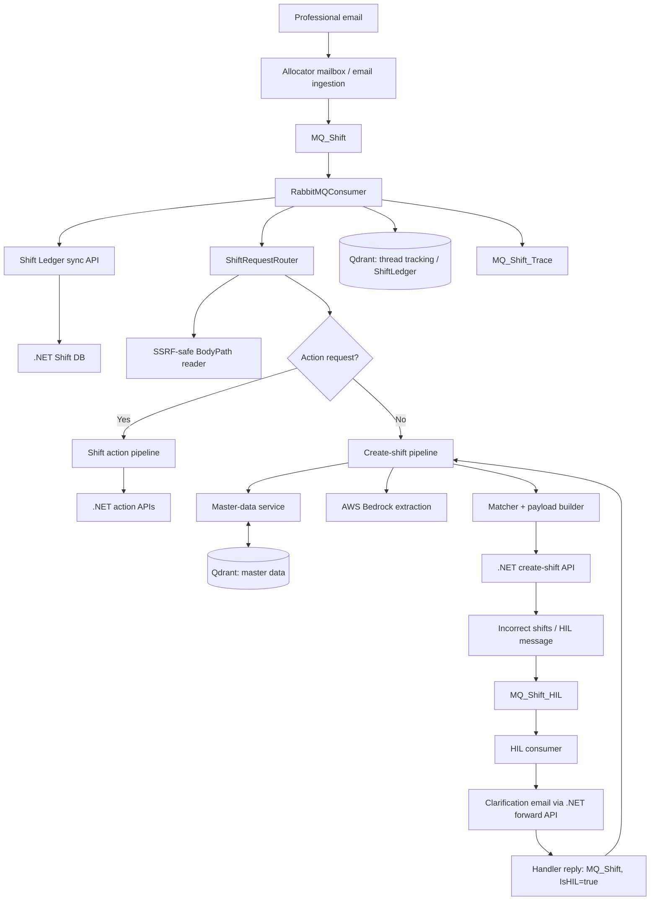
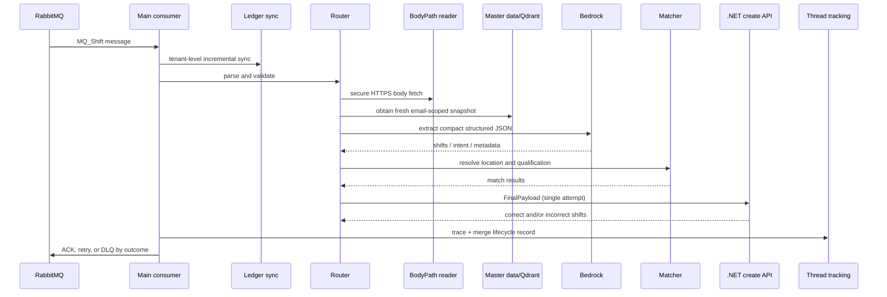

# AutoShift — Comprehensive Interview Preparation Guide

> **How to use this guide:** Answers marked **[Source]** are grounded in `Agent.md` and `AutoShift_Interview_QA.md`. Answers marked **[General]** are interview-ready engineering extensions; use them as design thinking, not as claims about the current implementation. Do not claim an item is implemented unless it is marked **[Source]**.

## 1. One-minute project story

### Q. Explain AutoShift in one minute.

**Answer — [Source]**

AutoShift is an AI-driven workforce shift-booking and shift-lifecycle automation service. It consumes request emails from RabbitMQ, securely reads the email body, uses AWS Bedrock to extract structured shift information, resolves locations and qualifications against client master data, and sends a validated payload to downstream .NET APIs to create shifts. It also supports existing-shift actions such as update, cancel, reinstate, and withdrawn.

The system is not only an LLM wrapper. It combines deterministic validation, Qdrant-backed master data and thread state, Human-in-the-Loop (HIL) correction for invalid or ambiguous cases, retry/DLQ processing, and structured observability. The project reduced manual shift creation and action effort by about 65%.

### Q. What business problem does it solve?

**Answer — [Source]**

Shift requests often arrive as unstructured email. Manually reading them, identifying the correct service, delivery location, qualification, date, and time, and then creating or updating shifts is slow and error-prone. AutoShift converts that unstructured communication into controlled downstream operations, while routing uncertain cases to a human instead of making unsafe changes.

### Q. What was your role?

**Answer — adapt to your actual contribution**

I worked on the Python-based AI service and its production workflow: LLM extraction, deterministic normalization, master-data matching, API-payload shaping, queue processing, HIL handling, Qdrant state, and testing. I would emphasize the components I directly owned and be precise about work owned by other teams, especially the downstream .NET services and email ingestion.

## 2. Architecture

### Source-based architecture

### Q. Why is the design event-driven?

**Answer — [Source]**

RabbitMQ decouples email ingestion from AI processing. The service can consume asynchronously, apply retry and DLQ policy, and keep the email publisher independent of Bedrock, Qdrant, and downstream API availability. This is useful because the workflow contains multiple network-dependent stages.

### Q. Why separate router, extractor, matcher, payload builder, and API client?

**Answer — [Source]**

Each component owns one responsibility. The router parses, validates, reads BodyPath, and routes create versus action requests. The extractor owns Bedrock prompting and output parsing. The matcher resolves business entities. The payload builder creates the strict .NET contract. The API client performs the handover and maps its response. This prevents the RabbitMQ consumer from becoming business-logic-heavy and makes deterministic logic independently testable.

### Q. What are the important runtime components?

**Answer — [Source]**

FastAPI owns lifecycle and operational endpoints; aio-pika consumers process `MQ_Shift` and `MQ_Shift_HIL`; httpx performs asynchronous HTTP calls; Bedrock performs extraction and embeddings; Qdrant stores vectors and durable payload state; Pydantic validates contracts and settings; and .NET APIs provide master data, shift creation/actions, ledger sync, and HIL-email forwarding.

## 3. End-to-end flows

### Create-shift flow

### Q. Walk through the normal create-shift flow.

**Answer — [Source]**

The main consumer receives an `MQ_Shift` message, obtains a per-thread lock, and does a tenant-level ShiftLedger sync before processing. The router validates the RabbitMQ contract and reads the email through the secure BodyPath reader. It first gives action-looking emails to the action pipeline; otherwise it enters the create pipeline.

The create pipeline loads an email-scoped master-data snapshot, calls Bedrock to extract shift data, resolves entities, builds a strict `FinalPayload`, and calls the .NET create API once. In a `finally` block the service publishes trace data and merges durable thread tracking in Qdrant, even if processing fails. The consumer then ACKs or routes the message using the defined retry/DLQ policy.

### Q. How does it detect create versus action flow?

**Answer — [Source]**

After the body is loaded, the router sends action-looking email subjects or bodies to the action pipeline first. Action-HIL replies are detected through `IsHIL=true` plus `[SHIFT ACTION]` in the subject. If the action pipeline does not handle the message, the router falls back to create processing. Mixed create/action requests are guarded: they are sent for HIL rather than silently processing only one part.

### Q. How does create-HIL re-entry work?

**Answer — [Source]**

Create-HIL detection uses only the explicit `IsHIL=true` flag; subject prefixes and previous-thread IDs are not trusted for this decision. The pipeline reads pending `PENDING_HIL` or `HIL_CORRECTION_FAILED` rows from the existing thread record, extracts the handler reply, and merges corrections only into fields that were missing or invalid. It preserves valid fields, applies the original ShiftID/EOHShiftID, requires a numeric ShiftID before handover, and marks ledger rows `HIL_CORRECTION_SUBMITTED`.

## 4. FastAPI, Python, async, and Pydantic

### Q. What does FastAPI do if the work is queue-driven?

**Answer — [Source]**

FastAPI is the application entrypoint and lifecycle manager. During startup it configures structured logging, initializes Qdrant collections and indexes, constructs the service graph, registers app-log publishing, and starts both RabbitMQ consumers as asyncio tasks. It also exposes operational endpoints such as health. The main business workload is queue-driven.

### Q. Why async Python?

**Answer — [Source]**

Most work is I/O-bound: consuming RabbitMQ, fetching BodyPath, calling master-data, create/action/HIL-forward and ledger-sync APIs, and accessing Qdrant. Async I/O lets the service make progress on other work while it waits on network calls, rather than blocking a worker thread.

### Q. What async mistakes would you avoid here?

**Answer — [General]**

I would avoid blocking CPU-heavy work or synchronous SDK calls on the event loop, creating an HTTP client per message, holding locks across unnecessary I/O, and starting uncontrolled background tasks. I would keep timeouts and cancellation explicit, bound concurrency, use connection pooling, and measure event-loop lag. If a dependency requires synchronous calls, I would isolate it carefully in a bounded executor or use an async-native alternative.

### Q. Why use Pydantic?

**Answer — [Source]**

Pydantic validates important boundaries early: `RabbitMessage` for the main queue, `HILCorrectionMessage` for HIL, extraction and payload models, action models, ledger-sync models, and centralized settings. This prevents malformed JSON or missing required fields from flowing into business logic or downstream APIs.

### Q. How is configuration managed?

**Answer — [Source]**

`Settings(BaseSettings)` centralizes environment-driven configuration. The service uses layered environment files by environment, nested environment support, aliases for legacy variable names, and a settings singleton. Queue names, model IDs, thresholds, paths, timeouts, collection names, and credentials are configurable rather than hard-coded.

### Q. How would you version an inbound message contract?

**Answer — [General]**

I would add an explicit schema version, keep backward-compatible parsers during migration, validate producer/consumer contracts in CI, and monitor validation failures by version. Destructive changes should use a new queue or a migration window—not a silent field rename.

## 5. Bedrock and LLM extraction

### Q. Why use AWS Bedrock?

**Answer — [Source]**

Bedrock provides managed access to the LLM used for natural-language extraction and to embedding capability while fitting an AWS-based enterprise deployment. In AutoShift it is used for extracting structured information from emails, not as the sole authority for business decisions.

### Q. What does the LLM extract?

**Answer — [Source]**

For create requests, it extracts intent and shift details such as location, qualification, date, start/end time, count, and related structured fields. For existing shifts it extracts action intent—reinstate, update, cancel, withdrawn, or unknown—and identifiers and fields used to locate or modify a shift.

### Q. How do you make LLM output reliable?

**Answer — [Source]**

The extraction pipeline requests compact structured JSON, strips code fences, attempts direct JSON parsing and recovery methods, cleans trailing commas, and retries with escalating token budgets when output is invalid, truncated, incomplete, has invalid dates, or lacks the expected shift count. Python then normalizes counts, dates, times, and data shape; it never trusts model arithmetic alone. A line-based extraction safety net can replace sparse or incomplete LLM output only when it found valid shifts.

### Q. Why compact JSON keys?

**Answer — [Source]**

Keys such as `i`, `s`, `c`, and `sc` reduce output tokens, cost, and truncation risk. The parser still accepts verbose aliases for backward compatibility. The system recomputes `sc` in Python after expanding counts rather than trusting the model.

### Q. Explain the retry design for Bedrock.

**Answer — [Source]**

The extractor has a multi-attempt loop with a base output-token limit and larger budgets on later attempts—base, double, then four times. It retries extraction-quality failures such as invalid JSON or truncation; on the final attempt it raises an error rather than accepting poor structured output.

### Q. What does “LLM flexibility, deterministic control” mean in this project?

**Answer — [Source]**

The LLM handles unstructured language understanding. Deterministic code controls contracts, count recomputation, date/time normalization, matching thresholds, payload construction, error classification, HIL field gates, and lifecycle state. This keeps the model from directly deciding business-critical writes.

### Q. How would you improve LLM evaluation?

**Answer — [General]**

I would maintain a versioned, de-identified email set with expected structured output, score field-level exactness and completeness, track parse failures and HIL rate by prompt/model, and run regression evaluations before prompt or model changes. Production sampling should be privacy-safe and linked to human corrections.

## 6. Qdrant, embeddings, vector search, and RAG

### Q. Why Qdrant?

**Answer — [Source]**

Qdrant stores email-scoped location and qualification master data for similarity-based retrieval, as well as durable payload state for thread tracking, ledger-sync cursors, professional patterns, and learned correction aliases. It supports vector search, payload filtering, and operationally useful collections in one service.

### Q. Does the matcher use vector search directly for every match?

**Answer — [Source]**

No. Qdrant holds and scopes master-data rows, but the create matcher uses deterministic fuzzy scoring over the snapshot. This lets the system combine lexical similarity, exact IDs/codes, delivery/service relationships, and business rules in a controlled way.

### Q. How is master data partitioned and refreshed?

**Answer — [Source]**

The partition key is lowercased `Email.From`, stored as `email_id` in Qdrant. The service first checks a bounded in-process LRU snapshot cache and Qdrant rows whose `last_loaded_date` is today in UTC. If data is absent or stale, it calls the .NET master-data API, generates embeddings, upserts rows with a new `refresh_id`, then prunes old rows for that same email partition. If refresh fails, it can use a bounded-age stale in-process cache; otherwise it raises a transient error.

### Q. Why is master data not preloaded at startup?

**Answer — [Source]**

The master-data API needs message-specific `Email.From`, tenant ID, and user ID, which do not exist at startup. Startup therefore creates collections and indexes only. The first normal or HIL message for an email partition triggers lookup or reseeding.

### Q. What Qdrant collections are used?

**Answer — [Source]**

`client_locations`, `client_qualifications`, `thread_shift_requests`, `tenant_shift_ledger_sync_state`, `professional_shift_patterns`, `qualification_correction_knowledge`, and `location_correction_knowledge`.

### Q. Why do thread records use zero vectors?

**Answer — [Source]**

`thread_shift_requests` is a durable keyed payload store indexed and retrieved by ThreadId, not a semantic-search collection. A zero vector avoids pretending that thread lifecycle data requires embedding similarity.

### Q. Is this a RAG system?

**Answer — [Source + precise wording]**

It uses retrieval concepts—embedding-backed master data, vector storage, payload filtering, and candidate retrieval—but the primary create flow is structured extraction and entity resolution rather than classic document-question-answer RAG. A safe interview answer is: “It is RAG-adjacent retrieval for grounding and matching; the core workflow is agentic automation, not a knowledge-base chatbot.”

### Q. What would you do when vector retrieval returns an incorrect but high-similarity match?

**Answer — [General, aligned with source]**

I would not automatically accept similarity alone. I would apply metadata constraints, service/delivery hierarchy checks, exact-code preference, score thresholds and margins, then send ambiguous cases to HIL. I would log candidate scores and final decision so thresholds can be tuned using correction outcomes.

## 7. Matching and payload construction

### Q. How does location and qualification matching work?

**Answer — [Source]**

The matcher merges extracted location information, resolves service and delivery rows separately, and resolves qualifications against the master-data snapshot. Delivery rows are distinct from service rows: delivery has a delivery ID and belongs under a service. A delivery-only match can backfill service through its service ID; conflicts are resolved by rules or left unresolved for HIL. The final result is mapped into a strict creation payload.

### Q. Why have separate service and delivery locations?

**Answer — [Source]**

The service identifies the client/service location, while delivery identifies a delivery-specific location under that service. Treating them as one field risks sending a valid-looking but semantically wrong downstream payload.

### Q. How do you process multiple shifts in one email?

**Answer — [Source]**

Extraction and deterministic post-processing can expand counts, date ranges, consecutive days, and role-quantity expressions into independent shift objects. Each object is matched and mapped separately before handover.

### Q. Why use a dedicated payload builder?

**Answer — [Source]**

The payload builder is the anti-corruption boundary between internal extraction/matching models and the .NET API contract. It owns field mapping and validation, so downstream casing and required fields do not leak throughout the pipeline.

### Q. What would you do if a valid-looking payload is rejected by .NET?

**Answer — [General]**

First distinguish transport failure from a delivered business validation failure. I would log the correlation ID, sanitized request/response, model output, match candidates, and payload-builder validation. If it is a correctable business issue, route to HIL with the exact invalid fields; if it is a contract regression, stop unsafe retries and coordinate a versioned API fix.

## 8. RabbitMQ, reliability, and idempotency

### Q. Explain the queue topology and outcome handling.

**Answer — [Source]**

The primary workflow uses `MQ_Shift`; HIL uses `MQ_Shift_HIL`; trace summaries go to `MQ_Shift_Trace`; application logs can be exported to `XWM_MQ_Shift_Log`. Success is ACKed after the pipeline returns. Transient non-handover failures are republished with an incremented `x-retry-count`; exhausted retries or permanent failures go to DLQ. Shift creation handover follows single-attempt rules to reduce the risk of duplicate business writes.

### Q. What is transient versus permanent here?

**Answer — [Source]**

Transient examples include HTTP 5xx, timeouts, network errors, most Bedrock SDK operational errors, and master-data transient failures. Permanent examples include invalid JSON, Pydantic validation errors, most HTTP 4xx, and Bedrock validation/access errors. Classification controls retry versus direct DLQ behavior.

### Q. Why is create-shift single-attempt?

**Answer — [Source]**

Creating a shift is a side-effecting business operation. If a timeout occurs after the downstream system received the request, blindly retrying can create a duplicate. The service uses typed handover errors and DLQ/ACK routing rather than automatic create retries.

### Q. What is the idempotency gap?

**Answer — [Source]**

RabbitMQ offers at-least-once delivery. A redelivery or DLQ replay can therefore call the create API again, and the current integration does not fully enforce a cross-system idempotency key. Duplicate shifts are possible.

### Q. How would you fix it?

**Answer — [Source-based improvement]**

Create a deterministic idempotency key from normalized thread/correlation data plus shift date/time, service, delivery, qualification, and professional identity. Persist it before handover and require the downstream API to return the already-created result for the same key. The API must own final deduplication because it is the side-effect boundary.

### Q. How do you prevent concurrency conflicts?

**Answer — [Source]**

The normal and HIL consumers share class-level per-ThreadId locks to serialize work that can modify the same Qdrant aggregate. Master-data loading also uses per-email async locks to avoid duplicate refreshes and reseed races. These are effective within the running service; multi-instance processing requires distributed coordination or partitioned consumption.

### Q. How would you scale consumers horizontally?

**Answer — [General]**

Increase consumers only after ensuring the broker’s prefetch/concurrency and dependency rate limits are safe. For same-thread ordering across instances, use a distributed lock, a partitioned queue keyed by ThreadId, or a single-writer state service. Pair this with idempotency, shared cache/state policy, backpressure, and autoscaling based on queue depth and processing latency.

## 9. Human-in-the-Loop and learning

### Q. What is HIL in AutoShift?

**Answer — [Source]**

HIL is the controlled correction path for missing, invalid, or ambiguous fields. When downstream .NET reports `IncorrectShifts`, the system records pending state, prepares a deterministic HTML clarification email with candidate suggestions, and sends it through the .NET forward API to a handler. The handler reply re-enters the normal queue and is merged safely with pending shift context.

### Q. How are correction fields gated?

**Answer — [Source]**

Only fields explicitly missing or invalid according to the .NET error messages may change. For example, if delivery location is the issue, delivery fields may change but correct qualification data is preserved. This prevents a correction reply from accidentally overwriting valid fields.

### Q. How does correction learning work?

**Answer — [Source]**

After a successful HIL correction handover, the service can learn raw qualification or location aliases only for fields that were actually missing. It stores source-thread information so the same alias is counted only once per thread, and it avoids learning unsafe location aliases when previous context is insufficient. Learned knowledge is then used during future resolution.

### Q. How are HIL suggestions ranked?

**Answer — [Source]**

Suggestions combine Qdrant master data and professional shift patterns. Frequently observed location/qualification combinations for the same professional rank more highly, and known location or qualification can constrain the other side of the suggestion.

### Q. How would you guard against bad learning from humans?

**Answer — [General]**

Learn only from confirmed successful outcomes, retain source and timestamp provenance, apply tenant/professional scope, require repeated evidence before broad reuse, and give operations a way to review or revoke aliases. Track whether learned aliases reduce HIL rate without increasing downstream rejections.

## 10. Existing-shift action flow

### Q. What actions does AutoShift support?

**Answer — [Source]**

It supports reinstate, update, cancel, and withdrawn actions. The action pipeline extracts intent and identifiers, identifies the source shift from ShiftLedger data, validates eligible statuses, builds an action payload, and calls the appropriate .NET endpoint.

### Q. How does action matching work?

**Answer — [Source]**

It prefers exact identifiers such as EOHShiftID, ShiftID, ThreadId, or order number. If exact identifiers are absent, it filters and scores candidates using date, start/end time, service, delivery, and qualification, while applying action-specific status rules. A unique, confident candidate is executed; ambiguity produces action-HIL instead.

### Q. How does action-HIL differ from create-HIL?

**Answer — [Source]**

Create-HIL corrects fields for new-shift creation. Action-HIL resolves an ambiguous existing target or action API business errors. Its subject contains `[SHIFT ACTION]`, it shows candidate shift rows and embeds hidden context for re-entry, and it maps handler confirmation back to a source ShiftLedger row.

### Q. How are multiple action intents handled?

**Answer — [Source]**

The action pipeline detects multiple distinct action types and create-plus-action combinations. It sends a guardrail HIL notification and does not call an action API or fall through to create flow, preventing partial or unsafe execution.

## 11. Thread tracking and ledger synchronization

### Q. What is `thread_shift_requests`?

**Answer — [Source]**

It is a Qdrant collection containing one durable lifecycle aggregate per ThreadId. It stores processing context, AI run data, states, errors, and ShiftLedger rows. It is updated in a best-effort `finally` path so attempts are recorded even when a business stage fails.

### Q. Why update tracking in `finally`?

**Answer — [Source]**

Operations and debugging need to see failed as well as successful attempts. Trace publication and tracking are deliberately best-effort and must never change the ACK/NACK decision; their own failures are caught and logged.

### Q. How does Shift DB sync work?

**Answer — [Source]**

Before normal and HIL processing, AutoShift calls a tenant-level incremental ledger-sync API using an optional tenant cursor. Returned Shift DB rows merge into existing thread aggregates by ShiftID; the system does not create a new thread aggregate from a DB-only row. The cursor is kept in `tenant_shift_ledger_sync_state`. After successful create handover, it persists tracking and performs another best-effort sync for DB-enriched fields.

### Q. How do you preserve authoritative DB data?

**Answer — [Source]**

When rows contain Shift DB sync markers, normal thread-tracking updates do not overwrite richer business values such as IDs, status, dates, service, delivery, qualification, order, or professional data with blank or less-authoritative values. Tracking can still add lifecycle metadata and HIL/action state.

## 12. Security

### Q. How is BodyPath reading secured?

**Answer — [Source]**

The reader permits HTTPS only and rejects missing hosts, localhost, non-allowlisted domains, and private or loopback IP literals. Redirects are disabled and requests have a configured timeout. Network/status failures may fall back to inline email body when available; URL-validation failures do not, because bypassing validation would weaken SSRF protection.

### Q. What other security controls exist?

**Answer — [Source]**

Credentials come from environment configuration, inbound contracts are validated through Pydantic, and HIL HTML content is escaped to reduce XSS risk. The design also limits trusted external fetch locations with a domain allowlist.

### Q. What additional production controls would you propose?

**Answer — [General]**

Use workload identities and least-privilege IAM for Bedrock, secrets rotation, TLS/mTLS where supported, encrypted broker and Qdrant storage, PII-aware logging/redaction, payload retention policies, audit trails for HIL changes, dependency scanning, and periodic SSRF allowlist review.

## 13. Observability, debugging, testing, and Docker

### Q. How is the service observable?

**Answer — [Source]**

It uses structured JSON logs with consistent stage/event names and correlation/thread context, per-thread log files, an error log, a trace queue, and filtered asynchronous application-log export. Logs cover routing, BodyPath read, extraction, match, payload build, handover, tracking, retries, and errors.

### Q. A shift was not created. What do you check?

**Answer — [Source]**

Search by CorrelationId and ThreadId. Check consumer receipt, BodyPath read, Bedrock extraction and parse output, master-data refresh, matcher candidates, payload-build validation, and create API response. Then inspect `thread_shift_requests` and retry/DLQ state. The trace record should show the lifecycle even if a processing stage failed.

### Q. How is the system tested?

**Answer — [Source]**

Focused pytest coverage exercises BodyPath SSRF rules, settings, consumer timeout and failure routing, helpers, extractor parsing and count expansion, matcher behavior, payload builders, HIL and reply merge, Qdrant correction payloads, thread tracking, queue models, ledger sync behavior, and the action flow. Deterministic business logic is kept separate to make unit testing practical.

### Q. What does Docker Compose provide?

**Answer — [Source]**

Local development composition includes the FastAPI app, Qdrant with persistent storage, and RabbitMQ management. The app runs on port 8000; Qdrant exposes 6333/6334; RabbitMQ exposes 5672 and management on 15672. The app mounts logs and read-only AWS credentials in the documented local setup.

## 14. Scenario and production deep dives

### Q. Bedrock returns malformed JSON twice and a truncated response on the final attempt. What happens?

**Answer — [Source]**

The parser tries its recovery chain and the retry loop increases output budget on subsequent attempts. If the final attempt remains invalid or incomplete, it raises rather than creating a shift from untrusted partial output. Consumer error classification then determines retry or DLQ based on the failure type.

### Q. Master-data API is down but a recent cache exists. What happens?

**Answer — [Source]**

When forced load is off, the service can return a stale in-process snapshot if its age is within the configured stale-cache maximum, logging a warning. If no acceptable cache exists, it raises `MasterDataTransientError` so the message can follow transient-failure routing.

### Q. A BodyPath URL points to a private IP but an inline email body is present. Do you use the inline body?

**Answer — [Source]**

No. Private-IP rejection is a URL-validation error, and there is deliberately no inline fallback for validation failures. Inline fallback is only for a genuine network/status `BodyPathReadError` after a valid URL was attempted.

### Q. The downstream create API times out. Why not retry immediately?

**Answer — [Source]**

The downstream service may have received and created the shift before the timeout. Immediate retry could duplicate a side effect. The system uses single-attempt handover semantics and records/reroutes according to the typed handover outcome.

### Q. A handler reply includes a new qualification and changes the date, but only qualification was invalid. What should happen?

**Answer — [Source]**

The HIL field-gating rule accepts the correction to qualification but preserves the already-valid date. HIL replies are not treated as unrestricted edits.

### Q. Two messages for the same thread arrive together.

**Answer — [Source]**

The shared per-ThreadId lock serializes normal and HIL work for that thread, protecting the thread aggregate from overlapping merges. At multi-instance scale, this should be supplemented with distributed locking or partitioned routing.

### Q. Qdrant becomes temporarily unavailable while thread tracking is being written.

**Answer — [Source]**

Tracking/trace persistence is best-effort in the `finally` path and does not alter a business message’s ACK/NACK. Qdrant’s operational paths also have retry/self-heal behavior for certain collection cases. The trade-off is that an individual tracking record may be missing until recovery; that should be surfaced through monitoring.

### Q. An action email contains “cancel the old shift and create a new one.”

**Answer — [Source]**

That is mixed intent. The action pipeline sends a guardrail HIL notification rather than executing only the cancel or silently falling through to create processing.

### Q. Retrieval returns equally plausible delivery locations.

**Answer — [Source + General]**

The safe result is unresolved/ambiguous matching and HIL rather than guessing. In an improvement cycle I would inspect candidate score margin, add discriminating metadata or prompt fields, and use correction results to tune thresholds.

## 15. Behavioral and ownership questions

### Q. What was the hardest technical challenge?

**Answer — [Source-based answer]**

The core challenge was making unstructured-email understanding safe enough for a transactional workflow. The solution was not to trust the LLM alone: we combined structured extraction, parser retries, deterministic normalization, master-data matching, strict payload models, HIL correction, and queue failure handling. Another complex area was preserving lifecycle continuity across normal emails, HIL replies, action operations, and Shift DB synchronization.

### Q. Describe a design trade-off you made.

**Answer — [Source]**

We chose single-attempt shift creation over automatic retries. That may reduce automatic recovery of some transient conditions, but it avoids a more serious risk: duplicate shift creation under at-least-once delivery when the downstream side-effect status is uncertain.

### Q. What would you improve first?

**Answer — [Source]**

I would close the end-to-end idempotency gap with a deterministic key recognized by the downstream API. I would also make HIL-forward API failures retryable rather than only logging and absorbing them, subject to the same duplicate-safe delivery design.

### Q. Why call this Agentic AI rather than a chatbot?

**Answer — [Source]**

The system does not stop after generating text. It observes an incoming request, extracts intent, retrieves and validates business context, chooses create or action flow, invokes external tools/APIs, escalates uncertainty to a human, learns from successful corrections, and records durable state. The LLM is one component inside a controlled action-taking workflow.

## 16. Rapid-fire deep-dive questions

| Question | Concise answer |
|---|---|
| Why only `IsHIL=true` for create-HIL detection? | **[Source]** Subject lines and previous-thread IDs are unreliable; the explicit flag makes re-entry deterministic. |
| Why preserve `CreatedAt` during tracking merge? | **[Source]** It represents the first lifecycle record and should not change with later attempts. |
| Why upsert before pruning stale master-data rows? | **[Source]** Two-phase refresh prevents losing usable old data before fresh data is successfully written. |
| Why recompute counts in Python? | **[Source]** Model arithmetic may be inconsistent; deterministic code keeps the final list correct. |
| Why capture LLM token usage? | **[Source]** For latency/cost observability; unknown model pricing safely produces zero cost rather than failing the pipeline. |
| Why use HTML escaping in HIL mail? | **[Source]** Handler-visible values may originate from email or model output and must not become executable markup. |
| How are Qdrant writes made resilient? | **[Source]** Chunked upserts, retries, retryable status handling, and recursive batch splitting for persistent transient failures. |
| Why use a tenant-level sync cursor? | **[Source]** It avoids per-thread scanning and provides a consistent incremental boundary for normal and HIL flows. |
| How do you know whether an action API “business failure” was delivered? | **[Source]** A returned `Status=false`/business-error response is delivered to .NET, even though the requested business operation failed. |
| What should never change ACK/NACK? | **[Source]** Best-effort trace publishing and thread-tracking persistence failures. |

## 17. Final interview reminders

- Lead with the 60-second project story, then draw the architecture only if asked.
- State project facts confidently; use phrases such as “I would propose…” for **[General]** enhancements.
- Do not describe classic document RAG if asked about AutoShift; explain the more accurate retrieval-and-entity-resolution design.
- Be transparent about the current idempotency limitation and explain the concrete cross-system fix.
- When asked about an incident, answer in this order: correlation ID → logs/traces → queue state → dependency response → Qdrant thread state → corrective action.

